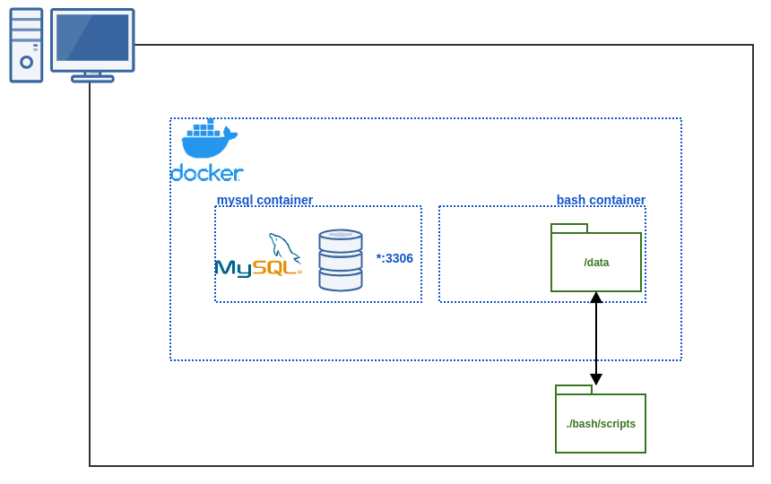

# Bash :: TP Backup

## Objectif

L'objectif de ce TP est d'arriver à créer un script de backup et de restoration pour une les bases de données MySQL.

La construction de ce script `bash`se fera en plusieurs étapes itératives.

## Prérequis

Pour réaliser ce TP, il vous faudra uniquement `docker`.

`docker` est un logiciel libre permettant facilement de lancer des applications dans des conteneurs logiciels (plus de détails sur le [site officiel](https://www.docker.com/) et [Wikipedia](https://fr.wikipedia.org/wiki/Docker_%28logiciel%29)).

Pour installer `docker`, il vous suffira de suivre le [tuto officiel](https://docs.docker.com/install/).

Pour les besoins de l'exercice, nous allons avoir aussi besoin de `docker-compose` que vous pouvez installer en suivant le [tuto officiel](https://docs.docker.com/compose/install/).

## Architecture

* un container MySQL avec les bases de données qu'on souhaite sauvegarder
* un container qui contiendra les outils pour l'exercice

Notez sur le schéma le lien qu'il y a entre le répertoire `./bash/scripts` de votre machine et le répertoire `/data` du container bash.

Ce lien permet de partager le contenu de votre machine dans un containers (on parle de [`bind volumes`](https://docs.docker.com/storage/bind-mounts/)).
Par nature les containers sont isolés, ils ne voient rien de la machine surlaquelle ils sont lancés.
Les `bind volumes` vont vous permettre de pouvoir créer des scripts sur votre machine qui seront disponibles dans votre container.
Tout ce que vous allez créer dans `./bash/scripts` sera accessible dans le `/data` du container.

Les `bind volumes` sont aussi une méthode de persister les données d'un container car les containers sont volatiles.
C'est à dire qu'une fois un container terminé et détruit l'ensemble de ses données sont perdues.

## TP - Exercices

* [étape 0: vérifier que tous les requis sont bien là](./tp/step_0-check.md)
* [étape 1: faire un script qui dump une base de données](./tp/step_1-dump_db.md)
* [étape 2: ajouter des logs](./tp/step_2-log.md)
* [étape 3: ajouter des tests](./tp/step_3-test.md)
* [étape 4: archivage et chiffrement](./tp/step_4-archive.md)
* [étape 5: création d'un script de restore](./tp/step_5-restore.md)
* [étape bonus: toujours plus?](./tp/step_bonus.md)
